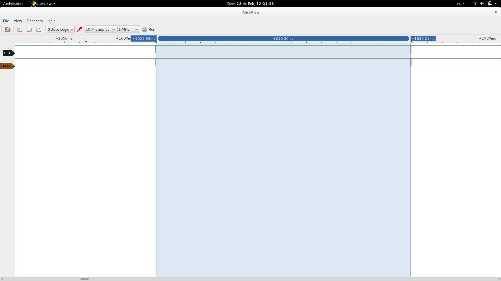
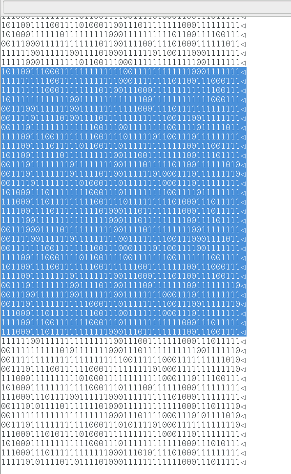
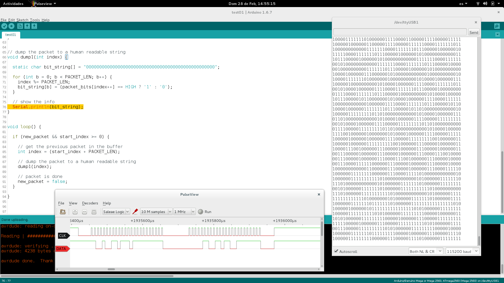

% CalliperHack
% Ictiómetro digital
% Vigo 28 de febrero 2016 #HackSB

# CalliperHack

## Problema

Medidor longitud de peces (*ictiómetro*) para ámbito oceanográfico.

----

<small>
By Retama, CC BY-SA 4.0, via Wikimedia Commons.
https://commons.wikimedia.org/wiki/File:Ictiometer_Alburnus.jpg
</small>

## Opciones

- Ictiómetros convencionales
- Ictiómetro digitales magnéticos
- Procesado de imagen
- Bandeja pulsadores

## Requisitos

- Barato
- Precisión milimétrica

## Nuestra solución

- Calibre digital
- Udoo/Arduino: driver
- Udoo/Linux: adquisición de datos publicación en broker MQTT

----

----

# Desarrollo

## Dificultades calibre

- Problemas eléctricos calibre digital
- Decodificar señal del calibre

## Arduino

- Interrupciones

## Linux

- Comunicación UART.

## Equipo

- 
  Rafa Couto (@caligari_pub)
- 
  Luigi Pirelli (@Ginetto)
- 
  Miguel González (@migonzalvar)
- 
  Jorge Tornero (@jtornero)

## Enlaces

- https://github.com/CalliperHack
- https://www.hackster.io/calliperhack/digital-ictiometer-based-on-a-accurate-calliper-0e5369
- 
  
  
# Gracias

# Anexos

## Fuentes

- YVODIC by Jorgue Tornero (@imasdemase) Ictiómetro digital usando pulsación de teclas: https://github.com/jtornero/YVODIc

## Screenshots

Primera captura de los datos emitidos por el calibre.

----

Timing de los paquetes enviados por el calibre.

----

Correspondencia en bits de los paquetes enviados por el calibre.

----

Sniffer creado en arduino pare descifrar los paquetes.

----

Varias decodificaciones de los paquetes para buscar los datos de la medición.

## Fotos

----

----

----

----

----

----

----

----

----

----

